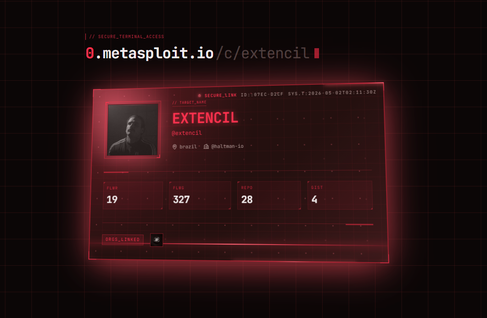

# profile.metasploit.io

`0.metasploit.io` is a static-exported Next.js app that turns public GitHub profiles into a clean hacker-style readout and a shareable profile card.

The actively maintained web app in this repository lives in `./profile`.

- Demo: <https://0.metasploit.io/>
- License: [The Unlicense](./LICENSE)
- App directory: `./profile`



> segfault.net was in maintenance. I used this time to work on this new project.
>
> It is open source, released under The Unlicense, and free for anyone to use wherever they want.

## Features

- GitHub profile lookup with a terminal-inspired UI.
- Two shareable views: full profile pages at `/p/{username}` and compact cards at `/c/{username}`.
- Public GitHub REST API integration with no backend or API key required.
- Client-side caching in `localStorage` to reduce repeat requests.
- Static export output that can be deployed to a CDN or any static host.

## Stack

- Next.js 16
- React 19
- TypeScript
- Tailwind CSS 4
- GSAP
- shadcn/ui primitives and Base UI

## Run Locally

No environment variables are required.

### Development

```bash
cd profile
npm install
npm run dev
```

Then open <http://localhost:3000>.

### Production Preview

This app uses `output: "export"`, so the production build must be served as static files.

```bash
cd profile
npm install
npm run build
npx serve@latest out
```

Open the local URL printed by `serve`.

## Routes

- `/` lookup page
- `/p/{username}` full profile view
- `/c/{username}` compact profile card

Examples:

- <http://localhost:3000/p/octocat>
- <http://localhost:3000/c/octocat>

## Quality Checks

```bash
cd profile
npm run lint
npm run typecheck
npm run build
```

## Notes

- Data comes from the public GitHub API. Without authentication, GitHub allows 60 requests per hour per IP.
- Deep links are resolved client-side from the exported `404` page so static hosting can still serve `/p/{username}` and `/c/{username}`.
- The production export is written to `profile/out/`.

## License

This project is released under [The Unlicense](./LICENSE). Use it anywhere.